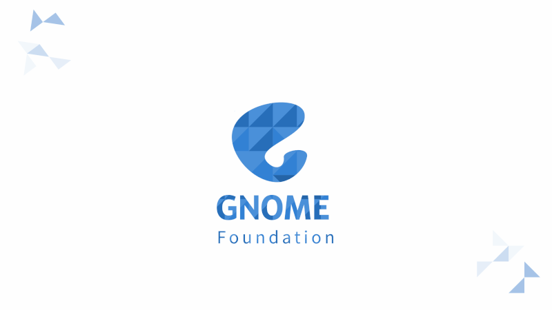

# Hello GNOME!
I am Varun R Mallya, a 3rd year engineering student at the Indian Institute of Technology, Roorkee. I am now a part of the GNOME community as a Google Summer of Code 2025 intern :). I will be working on the [Sysprof](https://gitlab.gnome.org/GNOME/sysprof) project under the mentorship of [Christian Hergert](https://gitlab.gnome.org/chergert).

# What I'll be doing in the coming weeks
My proposal titled "Adding eBPF profiling capabilities to Sysprof" aims to add eBPF profiling capabilities to Sysprof. This will allow users to profile their applications using eBPF, which is a powerful and flexible tracing technology in the Linux kernel. The project will involve implementing a new backend for Sysprof that uses eBPF to collect profiling data, as well as integrating this backend into the existing Sysprof user interface.

##### You can take a look at my proposal [here](https://gitlab.gnome.org/varunrmallya/gsoc-proposal-sysprof-2025/-/blob/main/gsoc_proposal.pdf?ref_type=heads)

I'll be starting off with mostly validating what I wrote in the proposal and building small eBPF programs that do the thing even if they don't do it efficiently. My proposal aims to replace the data we got from `/proc` files using equivalent eBPF programs. Every time I manage to extract this data for each kind of `/proc` file, I will write a blog on how it works and how exactly I did it. It will indirectly serve as documentation for people who want to continue work on this after I am done with it.

After I am done with this, I'll add a pipeline to Sysprof that will compile these programs and add them to the final ELF. A lot of work will be involved here to make it compatible with older kernel versions since a small part of what I am doing has features available in newer kernels (I might be wrong here, but I don't know yet--I am talking about `bpf timers` and `bpf iterators`). This will involve BTF and CORE, which I am currently reading about.

# About me
I like any kind of systems programming mostly. `eBPF` certainly gets me excited and I have doing a lot of reading on it to be very honest. I have also been working on a few open source projects like GCC-Rust (GCC's new independent Rust compiler btw, check it out), Reth (The Rust implementation of Ethereum), WasmEdge (A WebAssembly runtime) and I am also involved in a few projects in my university. I am actually a Mechanical engineer undergoing training, so I am currently doing some research on drone swarming and GPU based fluid simulations under my profs. Apart from this, I work on `libp2p` for Protocol Labs (currently doing some interop work between the Python and Go implementations of it.)

