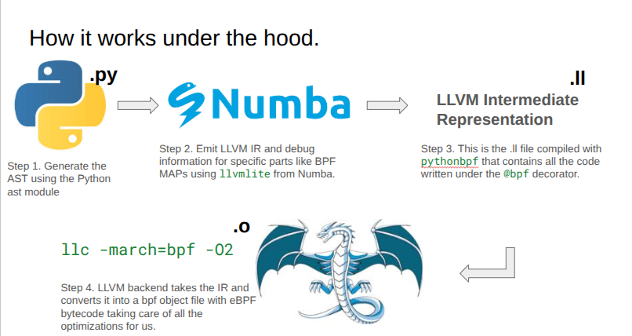

## Introduction

Python-BPF offers a new way to write eBPF programs entirely in Python, compiling them into real object files. This project is open-source and available on [GitHub](https://github.com/pythonbpf/python-bpf) and [PyPI](https://pypi.org/project/pythonbpf/). I wrote it alongside [R41k0u](https://github.com/r41k0u).

Update: This article has now taken off on [Hacker News](https://news.ycombinator.com/item?id=45221023).

## Published Library with Future Plans

Python-BPF is a published Python library with plans for further development towards production-ready use.  
You can `pip install pythonbpf` but it's certainly not at all production ready and the code is hacky at best with more bugs than I could count. (This was a hackathon project afterall. We plan to fix it after we are done with the hackathon.)

## The Old Way: Before Python-BPF

Before Python-BPF, writing eBPF programs in Python typically involved embedding C code within multiline strings, often using libraries like `bcc`. eBPF allows for small programs to run based on kernel events, similar to kernel modules.

Here's an example of how it used to be:

``` python
from bcc import BPF
from bcc.utils import printb

# define BPF program
prog = """
int hello(void *ctx) {
    bpf_trace_printk("Hello, World!\\n");
    return 0;
}
"""

# load BPF program
b = BPF(text=prog)
b.attach_kprobe(event=b.get_syscall_fnname("clone"), fn_name="hello")

# header
print("%-18s %-16s %-6s %s" % ("TIME(s)", "COMM", "PID", "MESSAGE"))

# format output
while 1:
    try:
        (task, pid, cpu, flags, ts, msg) = b.trace_fields()
    except ValueError:
        continue
    except KeyboardInterrupt:
        exit()
    printb(b"%-18.9f %-16s %-6d %s" % (ts, task, pid, msg))

```

This approach, while functional, meant writing C code within Python, lacking support from modern Python development tools like linters.

## Features of the Multiline C Program Approach

```python
# load BPF program
b = BPF(text="""
#include <uapi/linux/ptrace.h>

BPF_HASH(last);

int do_trace(struct pt_regs *ctx) {
    u64 ts, *tsp, delta, key = 0;

    // attempt to read stored timestamp
    tsp = last.lookup(&key);
    if (tsp != NULL) {
        delta = bpf_ktime_get_ns() - *tsp;
        if (delta < 1000000000) {
            // output if time is less than 1 second
            bpf_trace_printk("%d\\n", delta / 1000000);
        }
        last.delete(&key);
    }

    // update stored timestamp
    ts = bpf_ktime_get_ns();
    last.update(&key, &ts);
    return 0;
}
""")
```

The multiline C program approach allowed for features like BPF MAPS (hashmap type), map lookup, update, and delete, BPF helper functions (e.g., `bpf_ktime_get_ns`, `bpf_printk`), control flow, assignment, binary operations, sections, and tracepoints.

## Similar Program in Reduced C

For production environments, eBPF programs are typically written in pure C, compiled by `clang` into a bpf target object file, and loaded into the kernel with tools like `libbpf`. This approach features map sections, license global variables, and section macros specifying tracepoints.

``` c
#include <linux/bpf.h>
#include <bpf/bpf_helpers.h>
#define u64 unsigned long long
#define u32 unsigned int

struct {
    __uint(type, BPF_MAP_TYPE_HASH);
    __uint(max_entries, 1);
    __type(key, u32);
    __type(value, u64);
} last SEC(".maps");

SEC("tracepoint/syscalls/sys_enter_execve")
int hello(struct pt_regs *ctx) {
    bpf_printk("Hello, World!\\n");
    return 0;
}

char LICENSE[] SEC("license") = "GPL";

```

## Finally\! Python-BPF

Python-BPF brings the true eBPF experience to Python by allowing the exact same functionality to be replaced by valid Python code. This is a significant improvement over multiline C strings, offering support from existing Python tools.

``` python
from pythonbpf import bpf, map, section, bpfglobal, compile
from ctypes import c_void_p, c_int64, c_int32, c_uint64
from pythonbpf.helpers import ktime
from pythonbpf.maps import HashMap

@bpf
@map
def last() -> HashMap:
    return HashMap(key_type=c_uint64, value_type=c_uint64, max_entries=1)

@bpf
@section("tracepoint/syscalls/sys_enter_execve")
def hello(ctx: c_void_p) -> c_int32:
    print("entered")
    return c_int32(0)

@bpf
@section("tracepoint/syscalls/sys_exit_execve")
def hello_again(ctx: c_void_p) -> c_int64:
    print("exited")
    key = 0
    last().update(key)
    ts = ktime()
    return c_int64(0)

@bpf
@bpfglobal
def LICENSE() -> str:
    return "GPL"

compile()

```

Python-BPF uses `ctypes` to preserve compatibility, employs decorators to separate the BPF program from other Python code, allows intuitive creation of global variables, and defines sections and tracepoints similar to its C counterpart. It also provides an interface to compile and run in the same file.

## How it Works Under the Hood

1.  **Step 1: Generate AST**
    The Python `ast` module is used to generate the Abstract Syntax Tree (AST).

2.  **Step 2: Emit LLVM IR**
    `llvmlite` from Numba emits LLVM Intermediate Representation (IR) and debug information for specific parts like BPF MAPs. The `.py` file is converted into LLVM Intermediate Representation.

3.  **Step 3: Compile LLVM IR**
    The `.ll` file, containing all code written under the `@bpf` decorator, is compiled using `llc -march=bpf -O2`.

    

## Salient Features

Previous Python options for eBPF relied on `bcc` for compilation, which is not ideal for production use. The only two real options for production-quality eBPF programs were `aya` in Rust and Clang with kernel headers in C. Python-BPF introduces a third, new option, expanding the horizons for eBPF development.

It currently supports:

  * Control flow
  * Hash maps (with plans to add support for other map types)
  * Binary operations
  * Helper functions for map manipulation
  * Kernel trace printing functions
  * Timestamp helpers
  * Global variables (implemented as maps internally with syntactical differences)

## TL;DR

  * Python-BPF allows writing eBPF programs directly in Python.
  * This library compiles Python eBPF code into actual object files.
  * Previously, eBPF programs in Python were written as C code strings.
  * Python-BPF simplifies eBPF development with Python decorators.
  * It offers a new option for production quality BPF programs in Python.
  * The tool supports BPF maps, helper functions, and control flow, with plans to extend to completeness later.

  Thanks for reading my poorly written blog :)
