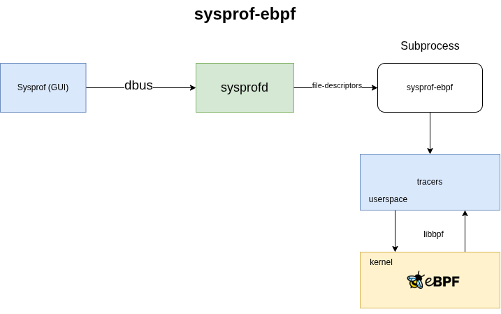
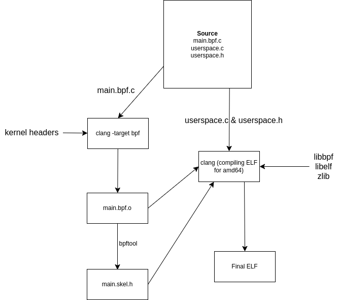
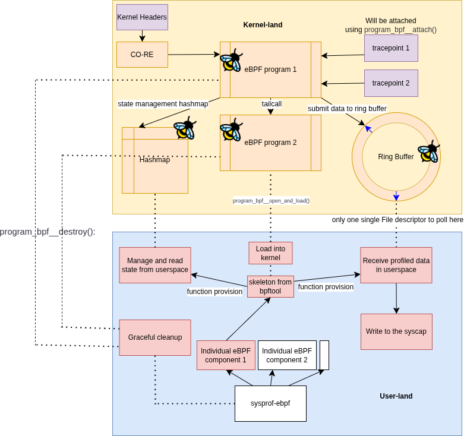

# Sysprof
This is a tool that is used to profile applications on Linux. It tracks function calls and other events in the system to provide a detailed view of what is happening in the system. It is a powerful tool that can help developers optimize their applications and understand performance issues. Visit [Sysprof](https://gitlab.gnome.org/GNOME/sysprof) for more information.

## sysprof-ebpf
This is a project I am working on as part of GSoC 2025 mentored by [Christian Hergert](https://gitlab.gnome.org/chergert). The goal is to create a new backend for Sysprof that uses eBPF to collect profiling data. This will mostly serve as groundwork for the coming eBPF capabilities that will be added to Sysprof. This will hopefully also serve as the design documentation for anyone reading the code for Sysprof-eBPF in the future.

## Testing
If you want to test out the current state of the code, you can do so by following these steps:
1. Clone the repo and fetch my branch.
2. Run the following script in the root of the project:
   ```bash
   #!/bin/bash
   set -euo pipefail
   GREEN="\033[0;32m"
   BLUE="\033[0;34m"
   RESET="\033[0m"
   
   prefix() {
       local tag="$1"
       while IFS= read -r line; do
           printf "%b[%s]%b %s\n" "$BLUE" "$tag" "$RESET" "$line"
       done
   }

   trap 'sudo pkill -f sysprofd; sudo pkill -f sysprof; exit 0' SIGINT SIGTERM

   meson setup build --reconfigure || true
   ninja -C build || exit 1
   sudo ninja -C build install || exit 1
   sudo systemctl restart polkit || exit 1
   
   # Run sysprofd and sysprof as root
   echo -e "${GREEN}Launching sysprofd and sysprof in parallel as root...${RESET}"

   sudo stdbuf -oL ./build/src/sysprofd/sysprofd 2>&1 | prefix "sysprofd" &
   sudo stdbuf -oL sysprof 2>&1 | prefix "sysprof" &
   
   wait
   ```


## Capabilities of Sysprof-eBPF

`sysprof-ebpf` will be a subprocess that will be created by `sysprofd` when the user selects the eBPF backend on the UI. I will be adding an options menu on the UI to choose which tracers to activate after I am done with the initial implementation. You can find my current dirty code [here](https://gitlab.gnome.org/varunrmallya/sysprof/-/tree/gsoc2025/pipeline). As of writing this blog, this MR has the following capabilities:
- **A tiny toggle on the UI**: Contains a tiny toggle on the UI to turn the activation of the eBPF backend on and off. This is a simple toggle that will start or stop the `sysprof-ebpf` subprocess.
- **Full eBPF compilation pipeline**: This is the core of the sysprof-ebpf project. It compiles eBPF programs from C code to BPF bytecode, loads them into the kernel, and attaches them to the appropriate tracepoints. This is done using the `libbpf` library, which provides a high-level API for working with eBPF programs. All this is done at compile time which means that the user does not need to have a compiler to run the eBPF backend. This will soon be made modular to be able to add more eBPF programs in the future.
<p align="center">
  
  </img>
</p>

- **cpu-stats tracer**:  Can track CPU usage of the full system by reading the exit state of a struct after a function that runs on requesting `/proc/stat` executes inside the kernel. I am working on finding methods to make this process not random and instead triggering this manually using bpf-timers. In the current state, this just prints this info to the console, but I will be soon adding capabilities to store this directly into the syscap file.
- **sysprofd**: My little program can now talk to `sysprofd` now and get the file descriptor to write the data to. I also accept an event-fd in this program that allows the the UI to stop this subprocess from running. 
I currently face a limitation on this where I have no option of choosing which tracers to activate. I am working on getting the tracer selection working by adding an options field to [SysprofProxiedInstrument](https://gitlab.gnome.org/GNOME/sysprof/issues/146).

#### Follow up stuff
- **Adding a way to write to the `syscap` file**: This will include adding a way to write the data collected by the tracers to the syscap file. I have already figured out how to do it, but it'll require a bit of refactoring which I will be doing soon.
- **Adding more tracers**: I will be adding more tracers to the sysprof-ebpf project. This will include tracers for memory usage, disk usage, and network usage. I will also be adding support for custom eBPF programs that can be written by the user if possible.
- **Adding UI**: This will include adding options to choose which tracers to activate, and displaying the data collected by the tracers in a more readable format.

## Structure of `sysprof-ebpf`
I planned on making this a single threaded process initially, but it dawned on me that not all ring-buffers will update at the same time and this will certainly block IO during polling, so I figured I'll just put each tracer in it's own `DexFuture` to do this capture in an async way. This has not been implemented as of writing this blog though. 
<p align="center">
  
  </img>
</p>

The eBPF programs will follow the this block diagram in general. I haven't made the config hashmap part of this yet, but I think I'll make it only if it's required in the future. All the currently planned features do not require this config map, but it certainly will be useful when I would need to make the program cross-platform or cross-kernel. This will be one of the last things I will be implementing in the project.


## Conclusion
I hope to make this a valuable addition to Sysprof. I will be writing more blogs as I make progress on the project. If you have any questions or suggestions, feel free to reach out to me on [GitLab](https://gitlab.gnome.org/varunrmallya) or [Twitter](https://x.com/SDLRenderer). Also, I'd absolutely LOVE suggestions on how to improve the design of this project. I am still learning and I am open to any suggestions that can make this project better.
