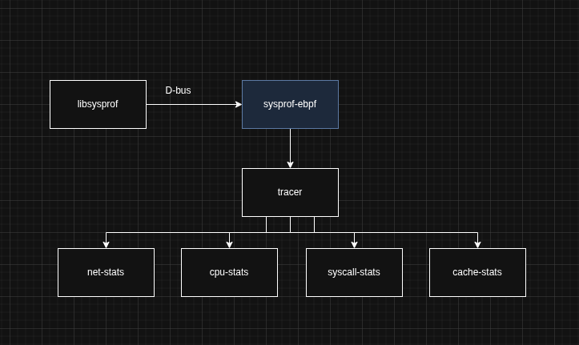
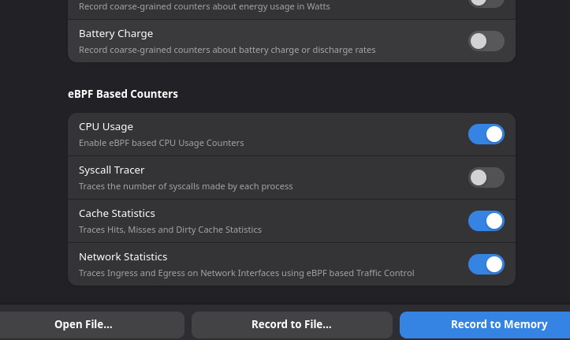
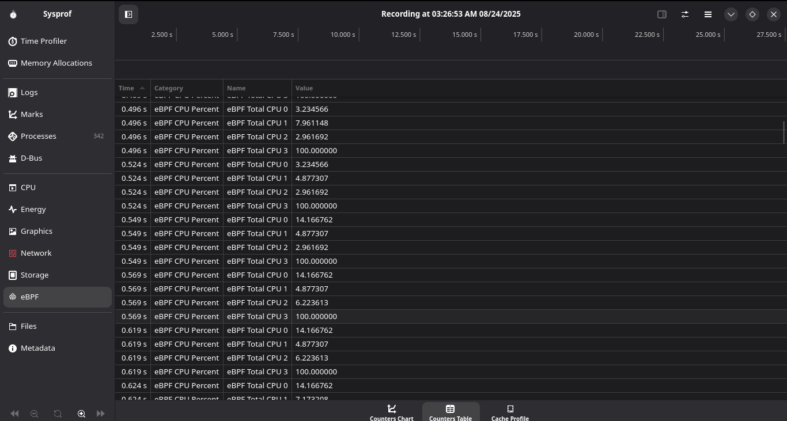
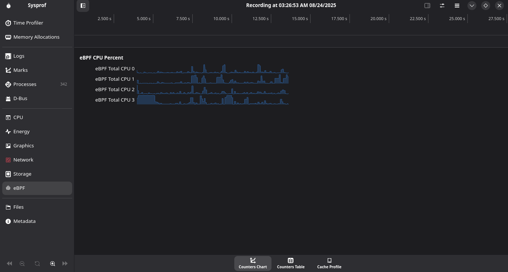

We have finally reached the last week of GSoC 2025. It has been an amazing journey so far and I hope I'll be able to contribute more to GNOME in the coming future. Let summarise what I've done over the past few months and I'll also link to a few blogs explaining parts of this that are too long to fit here.

# Introduction
This summer, I had the opportunity to work on GNOME's Sysprof, a full system profiling tool. I was tasked with adding eBPF capabilities to Sysprof allowing it to be even more powerful than it already is. As discussed with my mentor Christian Hergert (@chergert on gitlab.gnome.org), the project was transistioned from being just a project to reduce overhead of `/proc` file access to a bigger goal of allowing more eBPF programs to be added to Sysprof in general.  

[The main PR is here](https://gitlab.gnome.org/GNOME/sysprof/-/merge_requests/143)  
[Side hustle to add profiled function to source jumping](https://gitlab.gnome.org/GNOME/sysprof/-/merge_requests/145)  

This was accomplished by carefully designing the structure of the `sysprof-ebpf` binary with a few extensions planned for the future.  
Currently, Sysprof eBPF has capabilities to track CPU-usage, per interface network usage and can profile the cache as well. There is also a module written for getting per-process syscall usage for getting per-process syscall usage. But, ingesting data from this has proven to be quite a challenge for me. Also, we have better plans for this module in the coming future. 

# An overview of eBPF 
eBPF is a virtual machine present in the Linux kernel that allows tracing all functions that have not been inlined in the kernel. It allows adding a select number of data structures predefined in the standard and also ring buffers that allow buffering data into the userspace form the kernel just like proc allows for. eBPF is also pretty useful in the networking space. XDP and TC based eBPF programs can help process packets much faster by sometimes offloading programs to the network card itself. It's a huge thing in the container networking space now too! Check out [Cilium](https://github.com/cilium/cilium). eBPF is also being extensively used in observability and profiling software as well (In fact some projects provide a lot of what Sysprof does just using eBPF based programs!). For now, you can think of eBPF programs as verified and restricted kernel modules that are very portable across Kernel versions (if written right).

# The `sysprof-ebpf` module

(There is a blog over at https://xeon.me/gnome/sysprof/ that explains the design choices in this module in a little more detail.)

This is what the current state of sysprof-ebpf looks like. I tried to make everything as extensible as possible and very easy to add newer stuff to. The below stuff is what the UI currently looks like. I am yet to add the UI for network stats though. I plan to add many more modules after the final eval along with their respective UI as well. 

Just added a few clean switches that can turn these counters on and off. There is an instrument in the sysprof GUI that provides all the D-Bus communication logic for instruments. We inherit from this to create new instruments. This is pretty modular as well!

UI for the cache statistics collector. Manages to collect the hit ratios, misses and dirties. 

UI for the CPU statistics collector.  
This hooks on to the scheduler and calculates idle time vs busy time and manages to calculate the CPU usage percentage. This can be extended to collect frequency scaling statistics in the future as well!

There is also a fully functioning syscall tracer and a network statistics tracer. The syscall tracer has a few issues with data submission, but is otherwise completely fine! The network statistics collector is very powerful and extensible and is just missing UI. 

The syscall tracer collects so much data at once that I was having issues submitting all that data to write to the file! So..if I ever add it back, it'll be probably restricted to when a single program is being profiled and certainly not for the full system.  

The network statistics tracer hooks on to the TC (Traffic Control) ingress and egress points and accumulates the amount of bytes that pass through all the detected interfaces on the computer. This is pretty extensible because all the packet data is available in `sk_buff` and can be processed by just adding a few extra functions to the bpf program and it's corresponding processing functions on the userspace side.

# Process to add a new eBPF based counter
If anyone wants to add a counter to the eBPF module here, it's pretty easy to do so. Just copy and paste out the cpu-statistics tracer in the `sysprof-ebpf/tracers/cpu-stats` folder and change the bpf program in the `bpf` folder. Make name changes as necessary. There are pretty self descriptive functions that say what they do in their name and just add initializers for the counter in the respective functions. All counters inherit from the `tracer` object. Then, a similar thing can be done inside libsysprof where you can just copy out the structure of the cpu-stats file to make your own!

# Future work
So..as much as I hate to admit it, there are a few flaws with the `sysprof-ebpf` module. First off, each program runs in it's individual program spawned by `sysprofd`. I did a lot of planning to keep all the tracers multi-threadable, so adding this functionality shouldn't be too hard, but I'm trying to figure out how to do this with futures provided by `libdex`, so I've put it on hold. Also, I'd like to add a few more tracers that I think are uniquely possible to do with eBPF programs and extend the functionality of the current programs.

# Stuff I thought was pretty hard to do
- *D-Bus* was something that gave me a pretty bad time. Took me a few days to figure out it's ins and outs, but eventually managed to understand it to a point that I could write basic stuff I needed for the project
- *CPU-tracing* required me to find the calculations that could take the raw time differences between busy and idle phases of the CPU and turn them into acurate percentages. This was also made worse by the fact that eBPF programs do not allow floating point calculations, so I had to move the calculating part to userspace.

# Final remarks!
I LOVED the program. My mentor was a delight to work with and I really hope I can become a foundation member. I gained really new perspectives by spending time reading stuff on the Gnome Hackers IRC and Matrix chats and I want a career built on Open Source if it's possible to do! It was pretty sad that I was not able to attend GUADEC due to internship funding issues this year, but I did watch a lot of it online, and I really wish I can present some day. 