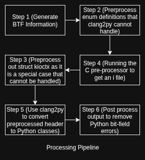

> If you just want the generation script, here it is: [vmlinux-gen](https://github.com/pythonbpf/Python-BPF/blob/master/tools/vmlinux-gen.py)

## The problem
So, you need kernel structs in Python, do you ? You dont want to write dataclasses yourself, do you ? It makes you cry, right ? I found a (barely) working solution.  

While writing eBPF programs, we generate a header file called `vmlinux.h` which is a combination of all the kernel debug info taken from `/sys/kernel/btf` to get all the required kernel structs on that installation. This is generally done with `bpftool`.  
When we tried to make something similar for PythonBPF, there was no C to Python transpiler that could reliably convert the kernel headers into Python Classes and bitfields to use. So, I had to modify the `clang2py` tool to do this conversion.

## The Transpilation Pipeline

  

